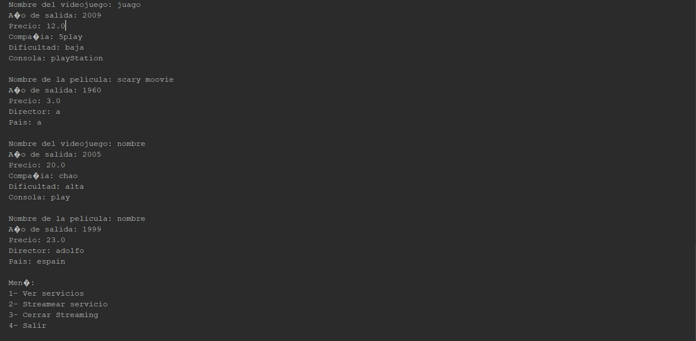

# 🛒🎮📽️ TiendaVideojuegosPeliculas 

**TiendaVideojuegosPeliculas** es una simulación de tienda en Java que permite ver todos los videojuegos y películas disponibles en un catálogo. Este proyecto es solo para la consola. ¡Podrás ver los productos disponibles! 🕹️

## 💡 Características

- **Catálogo de productos**: Incluye videojuegos y películas en un sistema simple de lista.
- **Interfaz en consola**: Todo se maneja a través de un menú interactivo 🖥️.
- **Añadir productos**: La tienda permite añadir nuevos videojuegos y películas al catálogo 📝.

## 🎮 Cómo utilizar

1. **Ejecuta el programa en la consola**:
   java TiendaVideojuegosPeliculas
2. **Se te presentará un menú con diferentes opciones opciones**:
3. **Selecciona la opción que desees y visualiza los productos disponibles**

## 📸 Captura de Pantalla

## ⚙️ Requisitos

- Java 8 o superior ☕
- Consola o terminal para ejecutar el programa 🖥️

## 🔧 Instalación

1. **Clona el repositorio**:
   git clone https://github.com/mariodiazzz11/TiendaVideojuegosPeliculas.git
2. **Navega al directorio del proyecto**:
   cd TiendaVideojuegosPeliculas
3. **Compila el proyecto (si es necesario)**:
   javac *.java

## 🚀 Contribuciones

Si deseas contribuir al proyecto, siéntete libre de hacer un fork y enviar pull requests. ¡Toda ayuda es bienvenida! 🤝

## 📄 Licencia

Este proyecto está bajo la licencia MIT. Para más detalles, consulta el archivo LICENSE.
